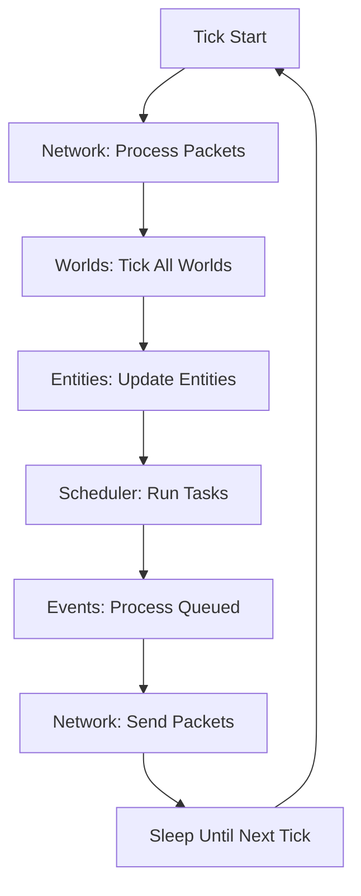
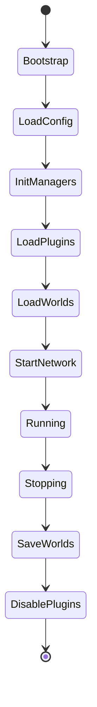

## Overview

PocketMine-MP is built on a **single-threaded tick-based architecture** that manages worlds, entities, players, and network operations. The server runs at a target rate of **20 ticks per second** (TPS), processing game logic synchronously while offloading heavy operations to async workers.

## Core Components

### Server Class

The `Server` class (`pocketmine\Server`) is the central hub that manages all server operations.

```php Server.php:183
class Server {
    public const TARGET_TICKS_PER_SECOND = 20;
    public const TARGET_SECONDS_PER_TICK = 1 / self::TARGET_TICKS_PER_SECOND;
    
    private PluginManager $pluginManager;
    private WorldManager $worldManager;
    private Network $network;
    private AsyncPool $asyncPool;
    private SimpleCommandMap $commandMap;
    private CraftingManager $craftingManager;
    // ...
}
```

<Info>
The server maintains a constant **50ms tick cycle** (1000ms / 20 ticks). Between ticks, the server sleeps using a `SleeperHandler` that can be woken up by network packets or other events.
</Info>

### Key Managers

<AccordionGroup>
  <Accordion title="PluginManager">
    Manages plugin loading, enabling, disabling, and event registration.
    
    ```php
    $pluginManager = $server->getPluginManager();
    $plugin = $pluginManager->getPlugin("MyPlugin");
    ```
  </Accordion>

  <Accordion title="WorldManager">
    Handles world loading, unloading, chunk management, and world ticking.
    
    ```php
    $worldManager = $server->getWorldManager();
    $world = $worldManager->getWorldByName("world");
    ```
  </Accordion>

  <Accordion title="Network">
    Manages network interfaces (RakLib), packet broadcasting, and compression.
    
    ```php
    $network = $server->getNetwork();
    $interfaces = $network->getInterfaces();
    ```
  </Accordion>

  <Accordion title="CommandMap">
    Routes commands to their handlers and manages command registration.
    
    ```php
    $commandMap = $server->getCommandMap();
    $commandMap->register("myplugin", new MyCommand());
    ```
  </Accordion>
</AccordionGroup>

## Threading Model

### Main Thread

The main thread runs the **tick loop** which processes:

1. **Network packets** - Incoming player actions
2. **World ticking** - Block updates, entity movement, chunk loading
3. **Entity updates** - Player movement, mob AI
4. **Scheduled tasks** - Plugin tasks registered via scheduler
5. **Event calls** - Synchronous event handlers

```php
// The main tick cycle (simplified)
while ($server->isRunning()) {
    $tickTime = microtime(true);
    
    $server->tick();  // Process one server tick
    
    $sleepTime = Server::TARGET_SECONDS_PER_TICK - (microtime(true) - $tickTime);
    if ($sleepTime > 0) {
        $server->sleepUntilNextTick($sleepTime);
    }
}
```

### Async Workers

The `AsyncPool` manages worker threads for CPU-intensive operations:

- **Chunk generation** - World terrain generation
- **Chunk I/O** - Loading/saving chunks from/to disk
- **Packet compression** - Batch packet compression (ZLIB)
- **Player authentication** - JWT verification for Xbox Live

```php
use pocketmine\scheduler\AsyncTask;

class MyAsyncTask extends AsyncTask {
    public function onRun(): void {
        // Runs on worker thread
        $this->setResult("Heavy computation result");
    }
    
    public function onCompletion(): void {
        // Runs back on main thread
        $result = $this->getResult();
    }
}

$server->getAsyncPool()->submitTask(new MyAsyncTask());
```

<Warning>
Never access server state (players, worlds, entities) from worker threads. Use `onCompletion()` to process results on the main thread.
</Warning>

## Tick Cycle

Each tick processes operations in a specific order:



### Tick Counter

The server maintains a tick counter starting from 0:

```php
$currentTick = $server->getTick();
$server->getLogger()->info("Current tick: $currentTick");
```

### TPS Monitoring

```php
$currentTPS = $server->getTicksPerSecond();
if ($currentTPS < Server::TARGET_TICKS_PER_SECOND * 0.8) {
    $server->getLogger()->warning("Server is running slowly! TPS: $currentTPS");
}
```

<Tip>
The server logs warnings when TPS drops below **12 TPS** (60% of target) for more than 5 seconds.
</Tip>

## Singleton Pattern

The `Server` instance is globally accessible:

```php
$server = Server::getInstance();
$logger = $server->getLogger();
$pluginManager = $server->getPluginManager();
```

<Note>
While the singleton pattern provides convenience, plugins should prefer dependency injection through their constructor where possible.
</Note>

## Memory Management

The `MemoryManager` monitors and controls memory usage:

```php
$memoryManager = $server->getMemoryManager();

// Trigger garbage collection
$memoryManager->triggerGarbageCollector();

// Check memory usage
$usage = $memoryManager->getUsage();
```

### Auto-GC Triggers

- Low memory threshold reached
- Every 30 minutes (configurable)
- Manual trigger via command

## Component Lifecycle



## Example: Accessing Components

```php
use pocketmine\Server;
use pocketmine\plugin\PluginBase;

class MyPlugin extends PluginBase {
    protected function onEnable(): void {
        $server = $this->getServer();
        
        // Access managers
        $worldManager = $server->getWorldManager();
        $pluginManager = $server->getPluginManager();
        $commandMap = $server->getCommandMap();
        
        // Get server info
        $this->getLogger()->info("Server tick rate: " . Server::TARGET_TICKS_PER_SECOND);
        $this->getLogger()->info("Current TPS: " . $server->getTicksPerSecond());
        $this->getLogger()->info("Online players: " . count($server->getOnlinePlayers()));
    }
}
```

## Best Practices

<CardGroup cols={2}>
  <Card title="Do" icon="check">
    - Use async tasks for heavy operations
    - Cache frequently accessed data
    - Batch operations when possible
    - Monitor TPS impact of your code
  </Card>
  
  <Card title="Don't" icon="xmark">
    - Block the main thread
    - Access thread-unsafe objects from workers
    - Create excessive scheduled tasks
    - Perform I/O on the main thread
  </Card>
</CardGroup>