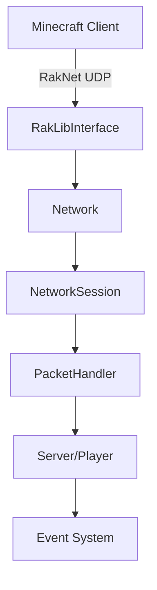
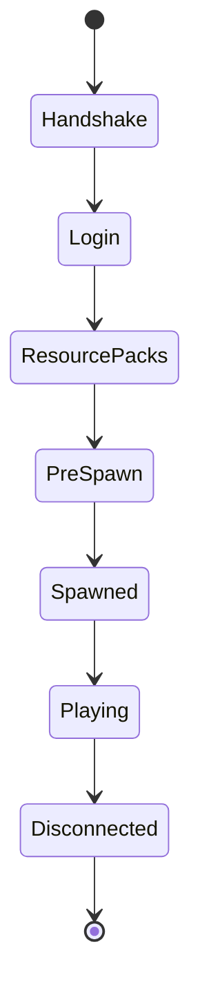

## Overview

PocketMine-MP uses **RakNet** for reliable UDP networking and implements the **Minecraft Bedrock protocol** to communicate with clients. Each player connection is managed by a `NetworkSession` that handles packet encoding, decoding, and processing.

## Network Architecture



## Network Class

The `Network` class manages network interfaces and packet broadcasting:

```php
use pocketmine\Server;
use pocketmine\network\Network;

$server = Server::getInstance();
$network = $server->getNetwork();

// Get network interfaces
$interfaces = $network->getInterfaces();

// Get network name (for query)
$name = $network->getName();
```

### Network Interfaces

- **RakLibInterface** - Main interface using RakNet for UDP
- **DedicatedQueryNetworkInterface** - Query protocol (server list ping)
- **UPnPNetworkInterface** - Port forwarding automation

## NetworkSession

Each connected player has a `NetworkSession` that manages their connection:

```php NetworkSession.php:146
class NetworkSession {
    private const INCOMING_PACKET_BATCH_PER_TICK = 2;
    private const INCOMING_GAME_PACKETS_PER_TICK = 2;
    
    private ?Player $player = null;
    private ?PlayerInfo $info = null;
    private ?int $ping = null;
    
    private bool $connected = true;
    private bool $loggedIn = false;
    private bool $authenticated = false;
    
    private ?EncryptionContext $cipher = null;
    private Compressor $compressor;
}
```

### Session States



## Packet Handling

### Packet Flow

1. **Receive** - RakNet receives UDP packet
2. **Decompress** - ZLIB decompression
3. **Decrypt** - Optional encryption (Xbox Live)
4. **Decode** - Parse packet structure
5. **Handle** - Process packet logic
6. **Respond** - Send response packets

### Packet Handlers

Packet processing changes based on session state:

```php
// Login phase
HandshakePacketHandler
LoginPacketHandler
ResourcePacksPacketHandler

// Pre-spawn phase
PreSpawnPacketHandler
SpawnResponsePacketHandler

// In-game phase
InGamePacketHandler

// Death screen
DeathPacketHandler
```

### Custom Packet Handling

```php
use pocketmine\event\Listener;
use pocketmine\event\server\DataPacketReceiveEvent;
use pocketmine\event\server\DataPacketSendEvent;
use pocketmine\network\mcpe\protocol\TextPacket;

class PacketListener implements Listener {
    
    public function onPacketReceive(DataPacketReceiveEvent $event): void {
        $packet = $event->getPacket();
        $origin = $event->getOrigin();
        
        if ($packet instanceof TextPacket) {
            $message = $packet->message;
            // Inspect or modify incoming packets
            
            if ($this->containsBadWords($message)) {
                $event->cancel(); // Block packet
            }
        }
    }
    
    public function onPacketSend(DataPacketSendEvent $event): void {
        $packets = $event->getPackets();
        $targets = $event->getTargets();
        
        // Inspect outgoing packets
        foreach ($packets as $packet) {
            if ($packet instanceof TextPacket) {
                // Log chat messages
                $this->logger->info("Sending: " . $packet->message);
            }
        }
    }
}
```

<Warning>
Cancelling packets can break game functionality. Only cancel packets if you know what you're doing.
</Warning>

## Packet Broadcasting

### Broadcasting to Players

```php
use pocketmine\network\mcpe\NetworkBroadcastUtils;
use pocketmine\network\mcpe\protocol\TextPacket;
use pocketmine\Server;

$server = Server::getInstance();

// Broadcast to all players
$packet = TextPacket::create(
    TextPacket::TYPE_RAW,
    "Server announcement!",
    "",
    ""
);

NetworkBroadcastUtils::broadcastPackets(
    $server->getOnlinePlayers(),
    [$packet]
);

// Broadcast to specific players
$players = [$player1, $player2, $player3];
NetworkBroadcastUtils::broadcastPackets($players, [$packet]);
```

### Packet Compression

Packets are automatically compressed using ZLIB:

```php
// Server.php configuration
private bool $networkCompressionAsync = true;
private int $networkCompressionAsyncThreshold = 10_000;
```

- Small packets (< 10KB) - Compressed synchronously
- Large packets (≥ 10KB) - Compressed on async worker threads

## Protocol Version

```php
use pocketmine\network\mcpe\protocol\ProtocolInfo;

// Current protocol version
$protocol = ProtocolInfo::CURRENT_PROTOCOL;
$minecraftVersion = ProtocolInfo::MINECRAFT_VERSION_NETWORK;

$server->getLogger()->info("Protocol: $protocol");
$server->getLogger()->info("Version: $minecraftVersion");
```

### Version Compatibility

```php
use pocketmine\event\Listener;
use pocketmine\event\player\PlayerPreLoginEvent;

class VersionChecker implements Listener {
    
    public function onPreLogin(PlayerPreLoginEvent $event): void {
        $playerInfo = $event->getPlayerInfo();
        // Protocol version checks happen automatically
        // This is just for custom logic
    }
}
```

<Info>
PocketMine-MP automatically rejects clients with incompatible protocol versions.
</Info>

## Encryption

### Xbox Live Authentication

When online-mode is enabled, sessions are encrypted:

```php NetworkSession.php:177
private ?EncryptionContext $cipher = null;
```

Encryption setup:

1. Client sends login packet with JWT chain
2. Server validates JWT signatures
3. Server generates encryption keys
4. `PrepareEncryptionTask` runs on async thread
5. Encryption enabled via `ServerToClientHandshakePacket`

### Online Mode Configuration

```yaml server.properties
xbox-auth=true   # Enable Xbox Live authentication
online-mode=true # Require authenticated accounts
```

```php
$server = Server::getInstance();

if ($server->getOnlineMode()) {
    // Xbox Live authentication required
    $server->getLogger()->info("Running in online mode");
}
```

## Network Sessions Management

### Getting Player Session

```php
use pocketmine\player\Player;

$player = $event->getPlayer();
$session = $player->getNetworkSession();

// Get ping
$ping = $session->getPing();
$player->sendMessage("Your ping: {$ping}ms");

// Check connection state
if ($session->isConnected()) {
    $player->sendMessage("Connection active");
}
```

### Disconnecting Players

```php
use pocketmine\player\Player;

// Kick with message
$player->kick("You have been kicked!");

// Disconnect (no message)
$player->disconnect("Internal disconnect");

// Transfer to another server
$player->transfer("play.example.com", 19132);
```

### Transfer Players

```php
use pocketmine\event\Listener;
use pocketmine\event\player\PlayerTransferEvent;

class TransferHandler implements Listener {
    
    public function onTransfer(PlayerTransferEvent $event): void {
        $player = $event->getPlayer();
        $address = $event->getAddress();
        $port = $event->getPort();
        
        $this->logger->info("{$player->getName()} transferring to {$address}:{$port}");
    }
}

// Transfer player
$player->transfer("lobby.example.com", 19132, "Sending you to the lobby!");
```

## Rate Limiting

PocketMine-MP implements packet rate limiting to prevent abuse:

```php NetworkSession.php:155
private PacketRateLimiter $packetBatchLimiter;
private PacketRateLimiter $gamePacketLimiter;
```

- **Packet batches**: 2 per tick (100 tick buffer)
- **Game packets**: 2 per tick (100 tick buffer)
- **Hard limit**: 300 packets total

Exceeding limits triggers automatic disconnect.

## Bandwidth Monitoring

```php
use pocketmine\network\BandwidthStatsTracker;

// Get network statistics (if available)
$network = $server->getNetwork();
$interfaces = $network->getInterfaces();

foreach ($interfaces as $interface) {
    if (method_exists($interface, 'getBandwidthTracker')) {
        $tracker = $interface->getBandwidthTracker();
        $sent = $tracker->getSent();
        $received = $tracker->getReceived();
        
        $server->getLogger()->info("Sent: {$sent} bytes, Received: {$received} bytes");
    }
}
```

## Network Events

```php
use pocketmine\event\Listener;
use pocketmine\event\server\NetworkInterfaceRegisterEvent;
use pocketmine\event\server\NetworkInterfaceUnregisterEvent;
use pocketmine\event\server\DataPacketReceiveEvent;
use pocketmine\event\server\DataPacketSendEvent;

class NetworkListener implements Listener {
    
    public function onInterfaceRegister(NetworkInterfaceRegisterEvent $event): void {
        $interface = $event->getInterface();
        $this->logger->info("Network interface registered: " . get_class($interface));
    }
    
    public function onPacketReceive(DataPacketReceiveEvent $event): void {
        $packet = $event->getPacket();
        $origin = $event->getOrigin();
        
        // Log all incoming packets
        $this->logger->debug("Received: " . get_class($packet));
    }
    
    public function onPacketSend(DataPacketSendEvent $event): void {
        $packets = $event->getPackets();
        $targets = $event->getTargets();
        
        // Monitor outgoing packets
        foreach ($targets as $target) {
            $player = $target->getPlayer();
            if ($player !== null) {
                $this->logger->debug("Sending " . count($packets) . " packets to " . $player->getName());
            }
        }
    }
}
```

## Creating Custom Packets

<Warning>
Creating custom packets requires modifying the protocol and is **not recommended** for most plugins. Use existing packets and events instead.
</Warning>

If you absolutely need custom packets:

1. Extend `ClientboundPacket` or `ServerboundPacket`
2. Implement encoding/decoding logic
3. Register with `PacketPool`
4. Handle on both client and server

This is **advanced** and usually unnecessary. Consider using:
- Plugin messages (via resource packs)
- Scoreboards for data display
- Forms for UI interactions
- NBT data in items

## Best Practices

<AccordionGroup>
  <Accordion title="Avoid Packet Spam">
    Batch operations to reduce packet count:
    
    ```php
    // Bad - Sends many packets
    foreach ($players as $player) {
        $player->sendMessage("Line 1");
        $player->sendMessage("Line 2");
        $player->sendMessage("Line 3");
    }
    
    // Good - Sends one packet
    $message = "Line 1\nLine 2\nLine 3";
    foreach ($players as $player) {
        $player->sendMessage($message);
    }
    ```
  </Accordion>

  <Accordion title="Monitor Connection Quality">
    Check player ping for lag detection:
    
    ```php
    $ping = $player->getNetworkSession()->getPing();
    if ($ping !== null && $ping > 500) {
        $player->sendTip("High latency detected: {$ping}ms");
    }
    ```
  </Accordion>

  <Accordion title="Handle Disconnects Gracefully">
    Always clean up player data:
    
    ```php
    public function onQuit(PlayerQuitEvent $event): void {
        $player = $event->getPlayer();
        $this->savePlayerData($player);
        $this->cleanup($player);
    }
    ```
  </Accordion>

  <Accordion title="Use Events, Not Raw Packets">
    Prefer high-level events over packet manipulation:
    
    ```php
    // Good - Use events
    public function onChat(PlayerChatEvent $event): void {
        $event->setMessage($this->filter($event->getMessage()));
    }
    
    // Bad - Manipulate packets (fragile)
    public function onPacket(DataPacketReceiveEvent $event): void {
        if ($event->getPacket() instanceof TextPacket) {
            // Complex and error-prone
        }
    }
    ```
  </Accordion>
</AccordionGroup>

## Common Networking Tasks

### Send Title to Player

```php
use pocketmine\network\mcpe\protocol\SetTitlePacket;

$player->sendTitle(
    "Main Title",
    "Subtitle",
    20,  // fadeIn (ticks)
    60,  // stay (ticks)
    20   // fadeOut (ticks)
);
```

### Send Action Bar

```php
$player->sendActionBarMessage("Health: " . $player->getHealth());
```

### Send Popup

```php
$player->sendPopup("You found a treasure!");
```

### Send Tip

```php
$player->sendTip("Press jump to fly");
```

All these methods use the underlying network session to send appropriate packets to the client.