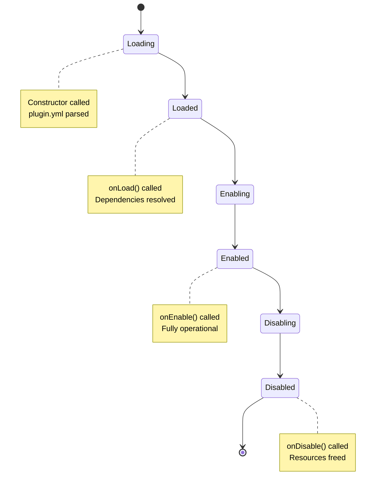

## Overview

Plugins in PocketMine-MP go through a well-defined lifecycle managed by the `PluginManager`. Understanding this lifecycle is crucial for proper resource initialization and cleanup.

## Lifecycle Phases



## Phase 1: Plugin Discovery

The `PluginManager` scans the plugins directory for valid plugins.

```php
// plugins/
//   MyPlugin.phar
//   AnotherPlugin.phar
//   MyPlugin/  (folder plugins)
```

### Supported Formats

- **PHAR archives** (`.phar`) - Loaded by `PharPluginLoader`
- **Script plugins** (`.php`) - Loaded by `ScriptPluginLoader`

## Phase 2: Loading

### Constructor

When a plugin is loaded, its constructor is called automatically:

```php PluginBase.php:58
public function __construct(
    private PluginLoader $loader,
    private Server $server,
    private PluginDescription $description,
    private string $dataFolder,
    private string $file,
    private ResourceProvider $resourceProvider
) {
    $this->dataFolder = rtrim($dataFolder, "/" . DIRECTORY_SEPARATOR) . "/";
    $this->configFile = Path::join($this->dataFolder, "config.yml");
    
    $prefix = $this->description->getPrefix();
    $this->logger = new PluginLogger($server->getLogger(), $prefix !== "" ? $prefix : $this->getName());
    $this->scheduler = new TaskScheduler($this->getFullName());
    
    $this->onLoad();
    $this->registerYamlCommands();
}
```

<Warning>
Never override the constructor. Use `onLoad()` instead for initialization logic.
</Warning>

### onLoad() Method

Called during construction, before the plugin is enabled:

```php PluginBase.php:82
protected function onLoad(): void {
    // Override this method for early initialization
}
```

**Use Cases:**
- Register custom generators
- Initialize static resources
- Set up data structures
- Register custom serializers

```php
use pocketmine\plugin\PluginBase;
use pocketmine\world\generator\GeneratorManager;

class MyPlugin extends PluginBase {
    protected function onLoad(): void {
        // Register custom world generator
        GeneratorManager::getInstance()->addGenerator(
            CustomGenerator::class,
            "custom",
            fn() => null
        );
        
        $this->getLogger()->info("Custom generator registered");
    }
}
```

<Info>
At this point, other plugins may not be loaded yet. Avoid accessing other plugins in `onLoad()`.
</Info>

## Phase 3: Dependency Resolution

The `PluginManager` resolves dependencies and determines load order.

### plugin.yml Dependencies

```yaml plugin.yml
name: MyPlugin
version: 1.0.0
main: MyNamespace\MyPlugin
api: 5.0.0

# Hard dependencies (required)
depend:
  - EssentialPlugin
  - DatabaseLib

# Soft dependencies (optional, load before if present)
softdepend:
  - OptionalPlugin

# Load order
load: POSTWORLD  # or STARTUP
```

### Load Orders

```php PluginEnableOrder.php
class PluginEnableOrder {
    public const STARTUP = 0;   // Before worlds are loaded
    public const POSTWORLD = 1; // After worlds are loaded (default)
}
```

## Phase 4: Enabling

### onEnable() Method

Called when the plugin is enabled and ready for use:

```php PluginBase.php:89
protected function onEnable(): void {
    // Override this method for main initialization
}
```

**This is where you should:**

<CardGroup cols={2}>
  <Card title="Register Event Listeners" icon="bell">
    ```php
    $this->getServer()->getPluginManager()
        ->registerEvents(new MyListener(), $this);
    ```
  </Card>
  
  <Card title="Schedule Tasks" icon="clock">
    ```php
    $this->getScheduler()->scheduleRepeatingTask(
        new MyTask(), 20
    );
    ```
  </Card>
  
  <Card title="Load Configuration" icon="gear">
    ```php
    $this->saveDefaultConfig();
    $config = $this->getConfig();
    ```
  </Card>
  
  <Card title="Initialize Services" icon="server">
    ```php
    $this->database = new Database($config);
    $this->api = new APIClient($config);
    ```
  </Card>
</CardGroup>

### Complete Example

```php
use pocketmine\plugin\PluginBase;
use pocketmine\event\Listener;

class MyPlugin extends PluginBase {
    
    private Database $database;
    
    protected function onLoad(): void {
        // Early initialization
        $this->getLogger()->info("Loading plugin data...");
    }
    
    protected function onEnable(): void {
        // Save default config if not exists
        $this->saveDefaultConfig();
        
        // Initialize database
        $this->database = new Database(
            $this->getConfig()->get("database")
        );
        
        // Register events
        $this->getServer()->getPluginManager()->registerEvents(
            new MyListener($this),
            $this
        );
        
        // Register commands
        $cmd = new MyCommand($this);
        $this->getServer()->getCommandMap()->register(
            "myplugin",
            $cmd
        );
        
        // Schedule repeating task (every 1 second)
        $this->getScheduler()->scheduleRepeatingTask(
            new AutoSaveTask($this),
            20
        );
        
        $this->getLogger()->info("Plugin enabled successfully!");
    }
    
    protected function onDisable(): void {
        // Cleanup resources
        $this->database->close();
        $this->getLogger()->info("Plugin disabled");
    }
    
    public function getDatabase(): Database {
        return $this->database;
    }
}
```

## Phase 5: Running

While enabled, the plugin is fully operational:

```php
$plugin->isEnabled();  // true
$plugin->isDisabled(); // false
```

### Accessing Plugin State

```php
// Get plugin instance
$myPlugin = $server->getPluginManager()->getPlugin("MyPlugin");

if ($myPlugin !== null && $myPlugin->isEnabled()) {
    // Safe to use plugin
    $myPlugin->doSomething();
}
```

## Phase 6: Disabling

### onDisable() Method

Called when the plugin is being disabled:

```php PluginBase.php:96
protected function onDisable(): void {
    // Override this method for cleanup
}
```

**You should:**

- Close database connections
- Cancel running async tasks
- Save pending data
- Unregister custom resources
- Free memory-intensive objects

```php
protected function onDisable(): void {
    // Save all pending data
    $this->dataManager->saveAll();
    
    // Close connections
    $this->database->close();
    $this->redisClient->disconnect();
    
    // Cancel tasks (automatic, but explicit is fine)
    $this->getScheduler()->cancelAllTasks();
    
    $this->getLogger()->info("All resources freed");
}
```

<Note>
Event listeners and scheduled tasks are automatically unregistered when a plugin is disabled.
</Note>

## Automatic Lifecycle Management

### What Gets Cleaned Up Automatically

```php PluginBase.php:115
final public function onEnableStateChange(bool $enabled): void {
    if ($this->isEnabled !== $enabled) {
        $this->isEnabled = $enabled;
        if ($this->isEnabled) {
            $this->onEnable();
        } else {
            $this->onDisable();
        }
    }
}
```

When disabled, the `PluginManager` automatically:

- Unregisters all event listeners
- Cancels all scheduled tasks
- Unregisters commands
- Clears handler lists

### Manual Cleanup Still Required

- Database connections
- File handles
- Network sockets
- External API connections
- Custom threads

## Plugin Reloading

<Warning>
PocketMine-MP does **not** support plugin reloading. Plugins must be disabled and the server restarted to reload code changes.
</Warning>

Why reloading isn't supported:

- PHP doesn't support unloading classes
- Static variables persist
- Memory leaks from circular references
- Event handler duplicates

## Best Practices

<AccordionGroup>
  <Accordion title="Separate Concerns">
    Use `onLoad()` for registration, `onEnable()` for initialization:
    
    ```php
    protected function onLoad(): void {
        GeneratorManager::getInstance()->addGenerator(...);
    }
    
    protected function onEnable(): void {
        $this->getServer()->getPluginManager()->registerEvents(...);
    }
    ```
  </Accordion>

  <Accordion title="Check Dependencies">
    Verify soft dependencies are available:
    
    ```php
    protected function onEnable(): void {
        $pm = $this->getServer()->getPluginManager();
        $economy = $pm->getPlugin("EconomyAPI");
        
        if ($economy === null) {
            $this->getLogger()->warning("EconomyAPI not found, some features disabled");
            $this->economyEnabled = false;
        }
    }
    ```
  </Accordion>

  <Accordion title="Graceful Degradation">
    Handle missing resources gracefully:
    
    ```php
    protected function onEnable(): void {
        if (!$this->saveDefaultConfig()) {
            $this->getLogger()->error("Failed to save config, using defaults");
        }
    }
    ```
  </Accordion>

  <Accordion title="Always Clean Up">
    Implement `onDisable()` to prevent resource leaks:
    
    ```php
    protected function onDisable(): void {
        foreach ($this->connections as $conn) {
            $conn->close();
        }
    }
    ```
  </Accordion>
</AccordionGroup>

## Events Related to Lifecycle

```php
use pocketmine\event\plugin\PluginEnableEvent;
use pocketmine\event\plugin\PluginDisableEvent;

class MyListener implements Listener {
    
    public function onPluginEnable(PluginEnableEvent $event): void {
        $plugin = $event->getPlugin();
        $this->getLogger()->info($plugin->getName() . " was enabled");
    }
    
    public function onPluginDisable(PluginDisableEvent $event): void {
        $plugin = $event->getPlugin();
        $this->getLogger()->info($plugin->getName() . " was disabled");
    }
}
```